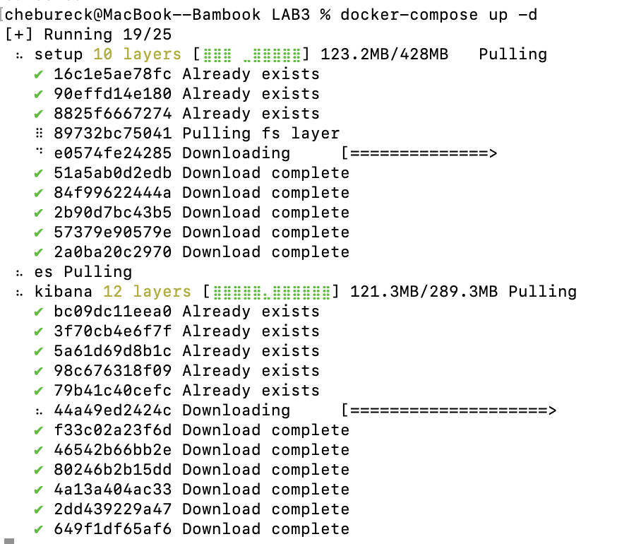

# Развертывание системы мониторинга ELK Stack (ElasticSearch)

Дутов Александр

## Цель

1.  Освоить базовые подходы централизованного сбора и накопления информации
2.  Освоить современные инструменты развертывания контейнирозованных приложений
3.  Закрепить знания о современных сетевых протоколах прикладного уровня

## ️Исходные данные

1.  ПК с ОС Mac OS
2.  Установленный и настроенный Docker

## Задание

1.  Развернуть систему мониторинга на базе Elasticsearch
    -   Elasticsearch
    -   Beats (Filebeat, Packetbeat)
    -   Elasticsearch Dashboards
2.  Настроить сбор информации о сетевом трафике
3.  Настроить сбор информации из файлов журналов (лог-файлов)
4.  Оформить отчет в соответствии с шаблоном

## Ход выполнения практической работы

Развертывание Elasticsearch осуществлялось с помощью Docker.

### Шаг 1. Развернуть систему мониторинга на базе ElasticSearch

#### 1. Установка и настройка Elasticsearch и Kibana произведена по информации с сайтов: <https://www.elastic.co/guide/en/elasticsearch/reference/current/docker.html> и <https://serveradmin.ru/ustanovka-i-nastroyka-elasticsearch-logstash-kibana-elk-stack/>

#### 2. Для работы ElasticSearch требуется увеличить размер виртуальной памяти системы:

    sudo sysctl -w vm.max_map_count=262144

#### 3. В новой директории необходимо создать файл .env для хранения параметров окружения

``` ()
ELASTIC_PASSWORD=XgV2s7avFI+AWIYpY - пароль пользователя elastic

KIBANA_PASSWORD=_V2hkw02naBt6nWtT8ba - пароль пользователя kibana_system

STACK_VERSION=8.7.1 - версия образов

CLUSTER_NAME=docker-cluster - имя кластера

LICENSE=basic - лицензия

ES_PORT=9200 - порт elasticsearch

KIBANA_PORT=5601 порт kibana

MEM_LIMIT=1073741824 - лимит памяти
```

### Шаг 2. Создание docker-compose.yml

#### В файле прописываем параметры контейнеров Elasticsearch, Kibana, Filebeat, Packetbeat, nginx

Настройки файла взяты с официального сайта elasticsearch: <https://www.elastic.co/guide/en/elasticsearch/reference/current/docker.html>

``` ()
version: '3'
services:
  setup:
    image: docker.elastic.co/elasticsearch/elasticsearch:${STACK_VERSION}
    volumes:
      - certs:/usr/share/elasticsearch/config/certs
    user: "0"
    command: >
      bash -c '
        if [ x${ELASTIC_PASSWORD} == x ]; then
          echo "Set the ELASTIC_PASSWORD environment variable in the .env file";
          exit 1;
        elif [ x${KIBANA_PASSWORD} == x ]; then
          echo "Set the KIBANA_PASSWORD environment variable in the .env file";
          exit 1;
        fi;
        if [ ! -f config/certs/ca.zip ]; then
          echo "Creating CA";
          bin/elasticsearch-certutil ca --silent --pem -out config/certs/ca.zip;
          unzip config/certs/ca.zip -d config/certs;
        fi;
        if [ ! -f config/certs/certs.zip ]; then
          echo "Creating certs";
          echo -ne \
          "instances:\n"\
          "  - name: es\n"\
          "    dns:\n"\
          "      - es\n"\
          "      - localhost\n"\
          "    ip:\n"\
          "      - 127.0.0.1\n"\
          "  - name: filebeat\n"\
          "    dns:\n"\
          "      - es\n"\
          "      - localhost\n"\
          "    ip:\n"\
          "      - 127.0.0.1\n"\
          "  - name: packetbeat\n"\
          "    dns:\n"\
          "      - es\n"\
          "      - localhost\n"\
          "    ip:\n"\
          "      - 127.0.0.1\n"\
          > config/certs/instances.yml;
          bin/elasticsearch-certutil cert --silent --pem -out config/certs/certs.zip --in config/certs/instances.yml --ca-cert config/certs/ca/ca.crt --ca-key config/certs/ca/ca.key;
          unzip config/certs/certs.zip -d config/certs;
        fi;
        echo "Setting file permissions"
        chown -R root:root config/certs;
        find . -type d -exec chmod 750 \{\} \;;
        find . -type f -exec chmod 640 \{\} \;;
        echo "Waiting for Elasticsearch availability";
        until curl -s --cacert config/certs/ca/ca.crt https://es:9200 | grep -q "missing authentication credentials"; do sleep 30; done;
        echo "Setting kibana_system password";
        until curl -s -X POST --cacert config/certs/ca/ca.crt -u "elastic:${ELASTIC_PASSWORD}" -H "Content-Type: application/json" https://es:9200/_security/user/kibana_system/_password -d "{\"password\":\"${KIBANA_PASSWORD}\"}" | grep -q "^{}"; do sleep 10; done;
        echo "All done!";
      '
    healthcheck:
      test: ["CMD-SHELL", "[ -f config/certs/es/es.crt ]"]
      interval: 1s
      timeout: 5s
      retries: 120

  es:
    depends_on:
      setup:
        condition: service_healthy
    image: docker.elastic.co/elasticsearch/elasticsearch:${STACK_VERSION}
    volumes:
      - certs:/usr/share/elasticsearch/config/certs
      - esdata:/usr/share/elasticsearch/data
    ports:
      - ${ES_PORT}:9200
    environment:
      - node.name=es
      - cluster.name=${CLUSTER_NAME}
      - cluster.initial_master_nodes=es
      - ELASTIC_PASSWORD=${ELASTIC_PASSWORD}
      - bootstrap.memory_lock=true
      - xpack.security.enabled=true
      - xpack.security.http.ssl.enabled=true
      - xpack.security.http.ssl.key=certs/es/es.key
      - xpack.security.http.ssl.certificate=certs/es/es.crt
      - xpack.security.http.ssl.certificate_authorities=certs/ca/ca.crt
      - xpack.security.transport.ssl.enabled=true
      - xpack.security.transport.ssl.key=certs/es/es.key
      - xpack.security.transport.ssl.certificate=certs/es/es.crt
      - xpack.security.transport.ssl.certificate_authorities=certs/ca/ca.crt
      - xpack.security.transport.ssl.verification_mode=certificate
      - xpack.license.self_generated.type=${LICENSE}
    mem_limit: ${MEM_LIMIT}
    ulimits:
      memlock:
        soft: -1
        hard: -1
    healthcheck:
      test:
        [
          "CMD-SHELL",
          "curl -s --cacert config/certs/ca/ca.crt https://localhost:9200 | grep -q 'missing authentication credentials'",
        ]
      interval: 10s
      timeout: 10s
      retries: 120

  kibana:
    depends_on:
      es:
        condition: service_healthy
    image: docker.elastic.co/kibana/kibana:${STACK_VERSION}
    volumes:
      - certs:/usr/share/kibana/config/certs
      - kibanadata:/usr/share/kibana/data
    ports:
      - ${KIBANA_PORT}:5601
    environment:
      - SERVERNAME=kibana
      - ELASTICSEARCH_HOSTS=https://es:9200
      - ELASTICSEARCH_USERNAME=kibana_system
      - ELASTICSEARCH_PASSWORD=${KIBANA_PASSWORD}
      - ELASTICSEARCH_SSL_CERTIFICATEAUTHORITIES=config/certs/ca/ca.crt
    mem_limit: ${MEM_LIMIT}
    healthcheck:
      test:
        [
          "CMD-SHELL",
          "curl -s -I http://localhost:5601 | grep -q 'HTTP/1.1 302 Found'",
        ]
      interval: 10s
      timeout: 10s
      retries: 120

  filebeat:
    depends_on:
      es:
        condition: service_healthy
    image: docker.elastic.co/beats/filebeat:${STACK_VERSION}
    container_name: filebeat
    volumes:
    - ./filebeat.yml:/usr/share/filebeat/filebeat.yml
    - ./logs/:/var/log/app_logs/
    - certs:/usr/share/elasticsearch/config/certs
    environment:
    - ELASTICSEARCH_HOSTS=https://es:9200
    - ELASTICSEARCH_USERNAME=elastic
    - ELASTICSEARCH_PASSWORD=${ELASTIC_PASSWORD}
    - ELASTICSEARCH_SSL_CERTIFICATEAUTHORITIES=config/certs/ca/ca.crt

  packetbeat:
    depends_on:
      es:
        condition: service_healthy
    image: docker.elastic.co/beats/packetbeat:${STACK_VERSION}
    container_name: packetbeat
    user: root
    cap_add: ['NET_RAW', 'NET_ADMIN']
    volumes:
    - ./packetbeat.yml:/usr/share/packetbeat/packetbeat.yml
    - certs:/usr/share/elasticsearch/config/certs
    - /var/run/docker.sock:/var/run/docker.sock
    environment:
    - ELASTICSEARCH_HOSTS=https://es:9200
    - ELASTICSEARCH_USERNAME=elastic
    - ELASTICSEARCH_PASSWORD=${ELASTIC_PASSWORD}
    - ELASTICSEARCH_SSL_CERTIFICATEAUTHORITIES=config/certs/ca/ca.crt

  nginx:
    container_name: nginx
    image: nginx:stable-alpine3.17
    ports: ['80:80']
    expose:
    - '80'
    command: nginx -g 'daemon off;'
    volumes:
      - ./logs/nginx/:/var/log/nginx/
volumes:
  certs:
    driver: local
  esdata:
    driver: local
  kibanadata:
    driver: local
```

### Шаг 3. В нашей директории создаем файлы filebeat.yml и packetbeat.yml

#### 1. Файл конфигурации Filebeat

Взят из репозитория: <https://github.com/elastic/beats/blob/main/filebeat/filebeat.yml>

``` ()
filebeat.inputs:
- type: filestream
  id: sys-logs
  enabled: true
  paths:
    - /var/log/apt/*

output.elasticsearch:
  hosts: '${ELASTICSEARCH_HOSTS:elasticsearch:9200}'
  username: '${ELASTICSEARCH_USERNAME:}'
  password: '${ELASTICSEARCH_PASSWORD:}'
  ssl:
    certificate_authorities: "/usr/share/elasticsearch/config/certs/ca/ca.crt"
    certificate: "/usr/share/elasticsearch/config/certs/filebeat/filebeat.crt"
    key: "/usr/share/elasticsearch/config/certs/filebeat/filebeat.key"
```

#### 2. Файл конфигурации Packetbeat

Взят отсюда: <https://raw.githubusercontent.com/elastic/beats/7.3/deploy/docker/packetbeat.docker.yml>

``` ()
packetbeat.interfaces.device: any

packetbeat.flows:
  timeout: 30s
  period: 10s

packetbeat.protocols.dns:
  ports: [53]
  include_authorities: true
  include_additionals: true

packetbeat.protocols.http:
  ports: [80, 5601, 9200, 8080, 8081, 5000, 8002]

packetbeat.protocols.memcache:
  ports: [11211]

packetbeat.protocols.mysql:
  ports: [3306]

packetbeat.protocols.pgsql:
  ports: [5432]

packetbeat.protocols.redis:
  ports: [6379]

packetbeat.protocols.thrift:
  ports: [9090]

packetbeat.protocols.mongodb:
  ports: [27017]

packetbeat.protocols.cassandra:
  ports: [9042]

processors:
- add_cloud_metadata: ~

output.elasticsearch:
  hosts: '${ELASTICSEARCH_HOSTS:elasticsearch:9200}'
  username: '${ELASTICSEARCH_USERNAME:}'
  password: '${ELASTICSEARCH_PASSWORD:}'
  ssl:
    certificate_authorities: "/usr/share/elasticsearch/config/certs/ca/ca.crt"
    certificate: "/usr/share/elasticsearch/config/certs/packetbeat/packetbeat.crt"
    key: "/usr/share/elasticsearch/config/certs/packetbeat/packetbeat.key"
```

### Шаг 4. Запуск docker-compose

``` ()
docker-compose up -d
```

{width="405"}

Активные контейнеры:

``` ()
docker ps
```

### Шаг 5. Работа с Elasticsearch

#### 1. Заходим на localhost:5601 и авторизируемся через пользователя elastic


#### 2. Проверяем, что filebeat и packetbeat отправляют данные elasticsearch

``` ()
GET _cat/indices
```


#### 3. Переходим в раздел "Discover" и создаем новый data view для filebeat


Получаем данные: 

#### 4. Cоздаем новый data view для packetbeat


#### 5. Полученная статистика

Packetbeat: 

Filebeat: 

## Оценка результата

Была развёрнута система ElasticSearch и настроена система сбора трафика и лог-файлов.

## Вывод

В результате работы была освоена система контейнеризации приложений Docker, работа с Docker-compose и освоена система централизованного сбора и накопления информации ElasticSearch.
