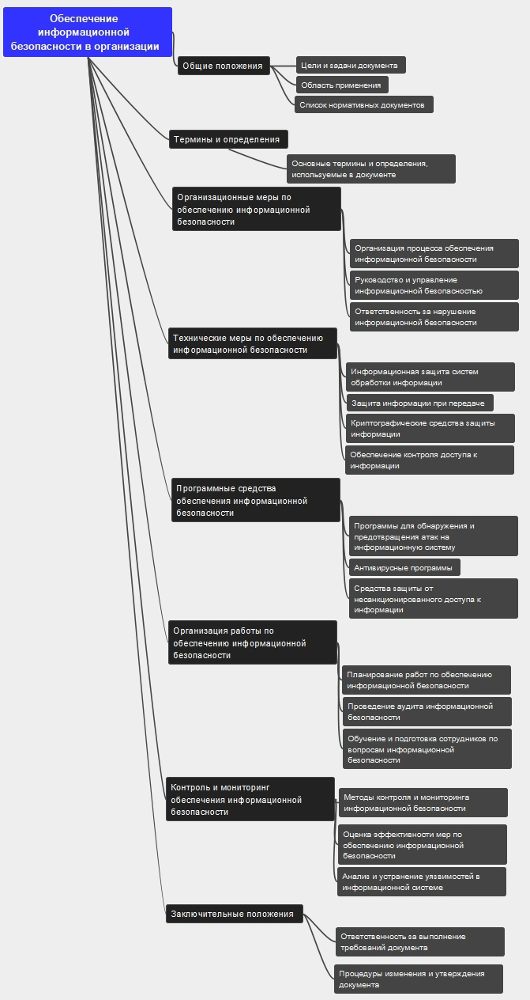

# Создание ментальной карты

Дутов Александр

## Цель работы

1.  Изучить международные и российские стандарты, связанные с
    информационной безопасностью

2.  Получить навыки систематизации информации с помощью ментальной карты

## Исходные данные

1.  ОС MAC OS

2.  Freeplane

3.  ГОСТ Р 53114-2008 **Защита информации. Обеспечение информационной
    безопасности в организации**

## Ход выполнения практической работы

С [веб-ресурса "Интернет и
Право"](https://internet-law.ru/gosts/gost/5737/) был скачан текст
стандарта ГОСТ Р 53114-2008**Защита информации. Обеспечение
информационной безопасности в организации**.

Далее, с помощью программы Freeplane была создана ментальная карта:

## Оценка результата

В ходе выполнения практической работы была создана ментальная карта
(файл schema.mm) по стандарту ГОСТ Р 53114-2008 "**Защита информации.
Обеспечение информационной безопасности в организации**".

## Выводы

Таким образом, с помощью ментальной карты удалось систематизировать
информацию о стандарте в удобном для чтения виде.
